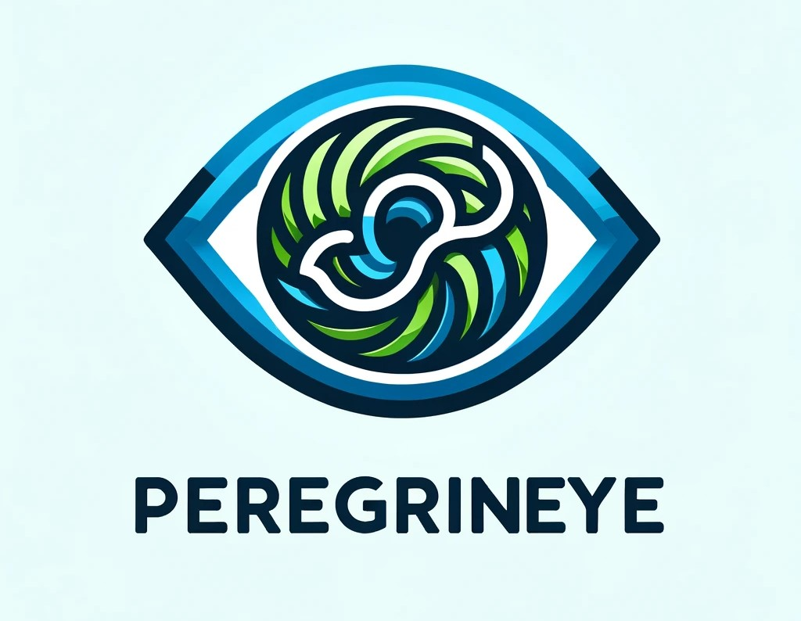

# PEREGRINEYE

AI-powered audio guidance for the visually impaired. Explore your surroundings, identify objects, and navigate with confidence.

## Inspiration

As a programmer, I spend countless hours staring at code.  One day,  eye strain forced me to confront the world with blurry vision. This experience highlighted the profound impact of sight on our daily lives. It sparked a question: could AI, the very technology that caused this temporary setback,  become a tool to assist when my vision needed a break?

## What it does
PEREGRINEYE is a pocket-sized AI assistant designed to empower the visually impaired. 


Here's what it can do right now:

* Image Description: Take a picture anywhere with sufficient light, and peregrinEYE will instantly describe the elements in the image from your perspective, providing rich details. It saves both the picture and the audio description as an MP3 for later reference.
* Coming in days: Interactive Guidance: Within days, peregrinEYE will take things a step further. Simply tell it what you're looking for in the captured image, and it will provide audio instructions to help you reach the object, navigate around obstacles, or interact with your surroundings.

## How we built it
peregrinEYE leverages some powerful tools:

* Image Description Engine: We utilize the robust Gemini vision model to analyze pictures taken by the device and generate detailed descriptions.

```python

prompt = """You are a a digital assistant designed to provide visual feedback for blind 
individuals, helping them navigate their surroundings. Upon receiving an image, describe 
in detail the key objects and structures, including their relative positions and contextual 
information. Your responses should be concise, clear, and informative, 
enabling users to orient themselves effectively. Additionally, learn and adapt to frequently 
visited places to provide personalized guidance. Be natural in your responses, and focus on 
providing valuable assistance to empower your users in their daily navigation."""
```

* Text-to-Speech (TTS): Google's Text-to-Speech (gTTS) engine converts the descriptive text into clear audio for users.

```python
from button_library import Button
import subprocess
import os
from PIL import Image
from audio_library import AudioRecorder
from gtts import gTTS
from pygame import mixer
from dotenv import load_dotenv
import os
load_dotenv
import glob
```

* Hardware: The core components include a Raspberry Pi Zero 2W, an Adafruit Voice Bonnet for audio input and output, and a UPS Lite for reliable power supply and a raspberry Pi camera. Python serves as the primary programming language. Here is the full device list:


* Efficient Storage: Photos are saved in JPEG format for space optimization, while conversations are stored as MP3 files.

## Challenges we ran into
Lighting Sensitivity:
* Poor Lighting Performance: As expected, Gemini Vision's accuracy diminishes significantly under poor lighting conditions. This leads to an increase in hallucinations and inaccurate object identification.
* Optimal Lighting Conditions: The model performs best with well-lit images, demonstrating greater precision and fewer hallucinations.

Hallucinations and Inferences:
* Object Hallucination: Gemini Vision sometimes identifies objects not actually present in the image. This often involves objects typically found in the scene's environment but absent from the specific picture. For example, it might infer the existence of a counter behind a shelf, even without visual evidence.
* Public Figure Misidentification: In one instance, the model incorrectly identified a Mexican public figure "Lily Tellez" on a billboard, despite the individual's absence from the image. This suggests a potential bias towards associating prominent figures with specific locations or contexts.


Distance and Detail:
* Close-up Image Accuracy: Gemini Vision exhibits better performance when analyzing close-up images. The details are more discernible, resulting in fewer hallucinations and more accurate object recognition.
* Challenges with Distance: Performance declines as the distance between the camera and the subject increases. Details become less clear, contributing to misinterpretations and hallucinations.

Recommendations:
* Lighting Control: Whenever possible, capture images under well-lit conditions to maximize Gemini Vision's accuracy.
* Data Augmentation: Training the model with diverse datasets containing images under various lighting conditions could improve its robustness and performance in challenging environments.
* Fine-Tuning and Calibration: Consider fine-tuning the model for specific use cases and environments to minimize hallucinations and bias.
* Human in the Loop: Integrating human oversight can help validate results, especially in critical applications.

Multitasking Management: 
* A significant ongoing challenge lies in managing multiple services simultaneously. This includes voice generation, AI API calls, button and microphone inputs, and ensuring a fast response time from the AI.

## Accomplishments that we're proud of
* Functional Prototype Development: We successfully built a fully functional prototype capable of sustained operation for several hours, capturing images and processing them using AI. This compact, handheld device incorporates audio reproduction and information display capabilities, showcasing the potential for a portable, self-contained AI system.

* Unconstrained AI Interaction: By freeing AI from the limitations of cellphones, we've created a platform for unconstrained interaction with the physical world. This opens doors for innovative applications across various domains. 


* Potential Impact: This prototype lays the groundwork for future advancements in portable AI, potentially revolutionizing fields like assistive technology, education, and field research.

*Additional Points to Consider:*
* Quantify Battery Life: Specify the exact duration the prototype can operate on a single charge, providing a clearer picture of its capabilities.
* Highlight Specific Applications: Mention potential applications of the prototype, such as object identification for visually impaired individuals, real-time language translation, or augmented reality experiences.
* Future Development Plans: Briefly touch on future development goals, like improving battery life, enhancing processing power, or exploring new AI models.

## What we learned
This project has been a valuable learning experience:

* The Power of Vision Models: We gained a deeper understanding of how vision models work and how they can link different images to provide insightful information about the world around us.
* Multitasking Mastery: The importance of efficiently managing multiple processes running concurrently on a limited-resource device became abundantly clear.
* Minimalist Design for Accessibility: We prioritized creating a user-friendly and minimalistic device that can be easily used by anyone, especially those with visual impairments.

## What's next for peregrinEYE
* PrevisAI: We envision a system within peregrinEYE called "PrevisAI" that can anticipate your needs and movements based on the images you provide, offering proactive assistance.
* Beyond the Initial Prototype: We're actively working on integrating the features you mentioned, including color identification, object location assistance, and even walkthrough assistance for video games.
* Real-Time Obstacle Detection: peregrinEYE will evolve to not only identify objects but also detect potential obstacles in real-time, enhancing safe navigation for users.
